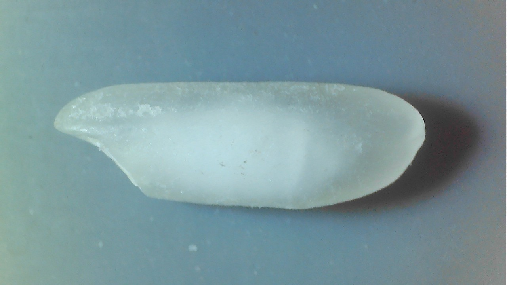
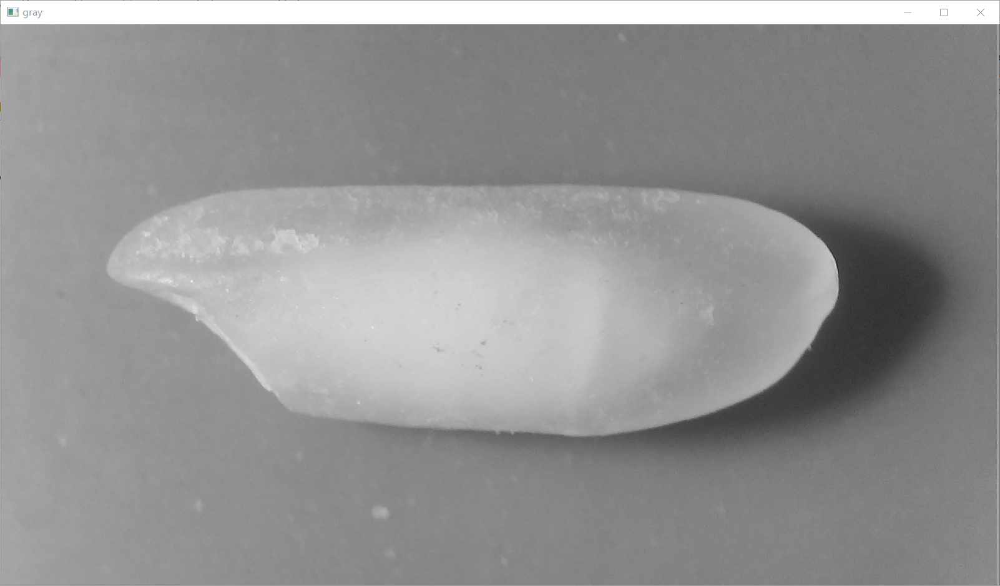
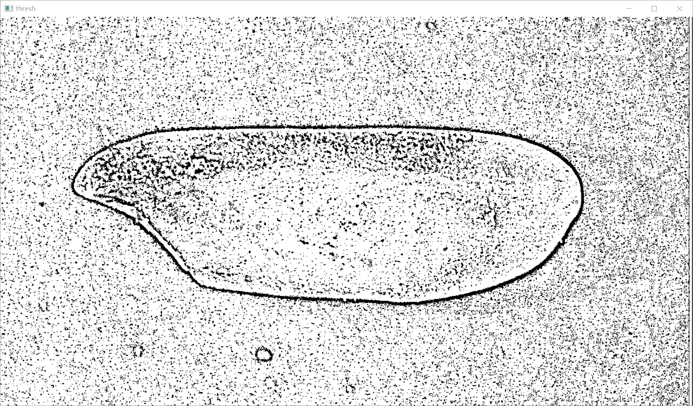
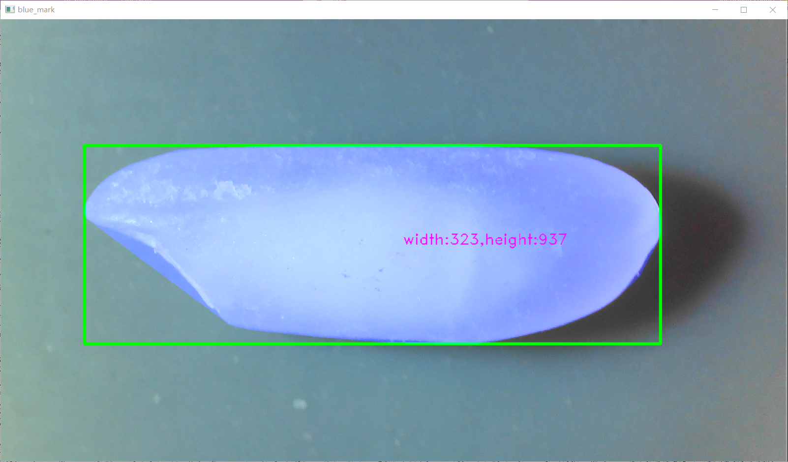
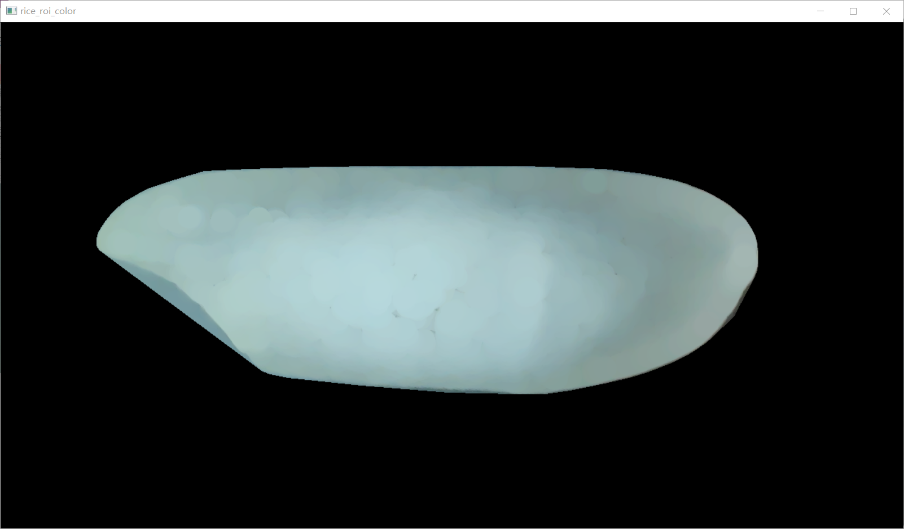
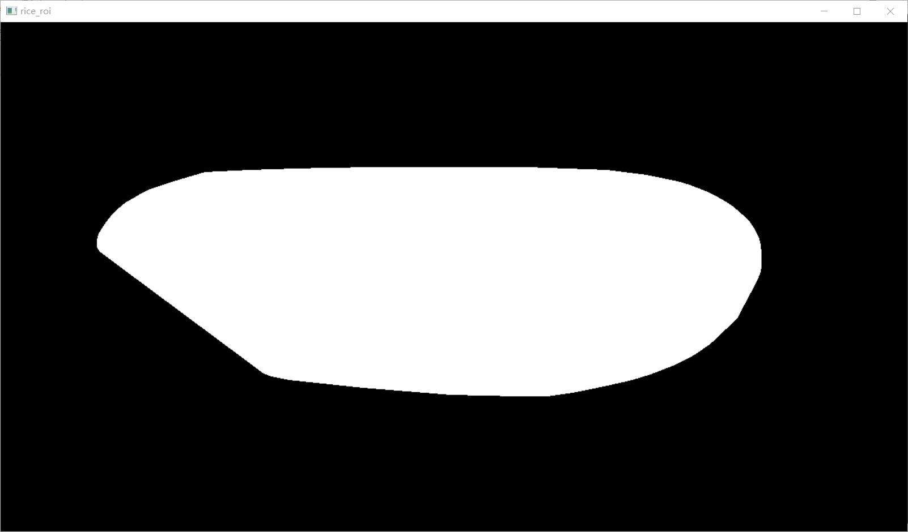
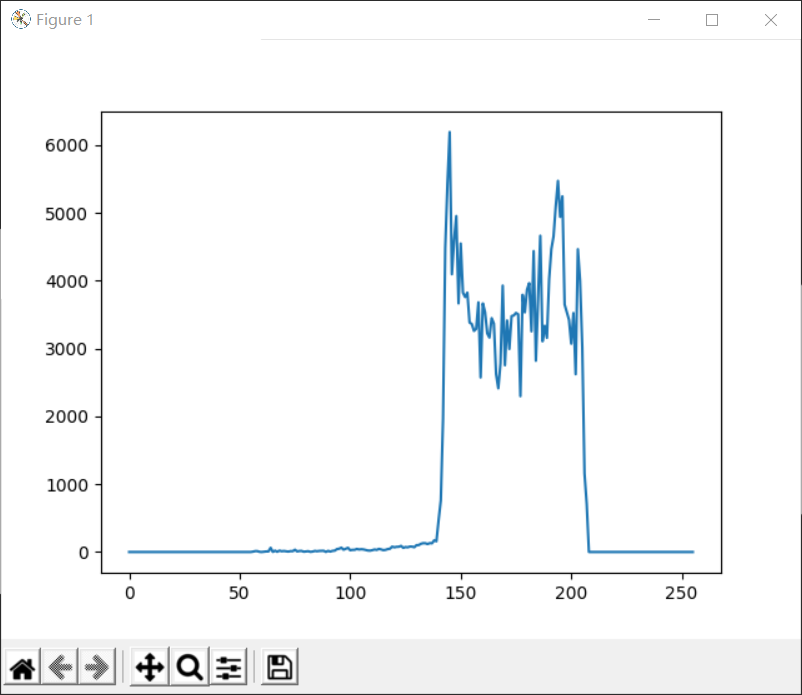
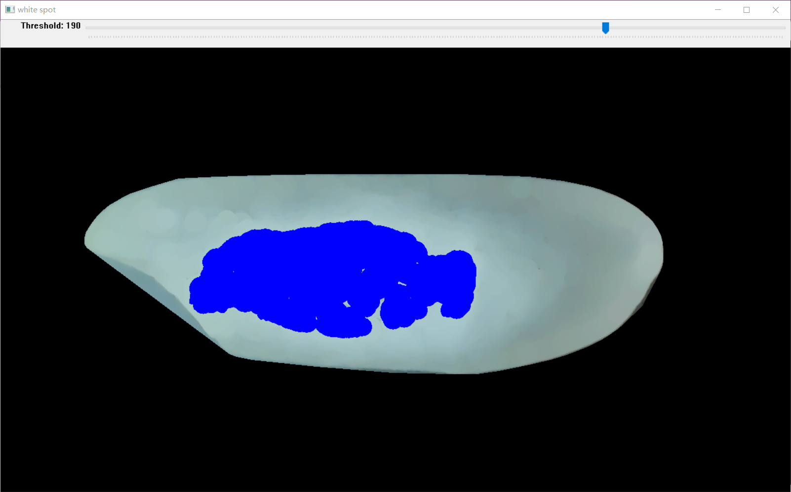
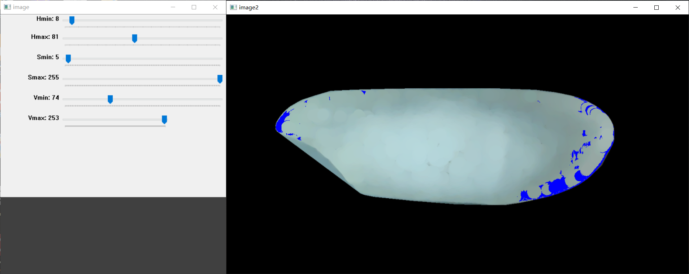
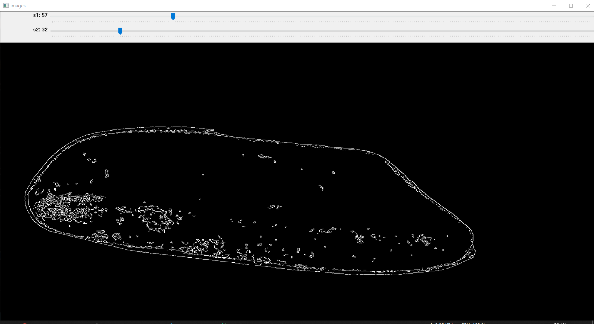

# File Description
| 文件名                | 功能描述                                                                                           |
|-----------------------|--------------------------------------------------------------------------------------------------|
| fenzhi.py             | 实现凸包长度计算和最大/次大轮廓分析的函数。                                                      |
| get_xy.py             | 在图像上显示鼠标点击坐标的函数。                                                               |
| grayscale.py          | 提供不同的灰度化方法来转换RGB图像为灰度图像。                                                  |
| main.py               | 对图像执行多种处理操作，包括大米目标区域提取、轮廓绘制、白点检测、黄米检测、断面检测等。                               |
| may.py                | 实现凸包长度计算和最大/次大轮廓分析的函数。                                                      |
| rice_detect.py        | 检测大米图像中的目标区域、绘制边界框和标签等处理。                                              |
| test_canny.py         | 使用Canny算法进行图像边缘检测，并动态调整参数以显示结果。                                       |
| test_contrast_stretching.py | 对图像执行对比度拉伸操作，增强图像的对比度。                                           |
| test_findContours.py  | 对图像进行轮廓检测，并绘制轮廓及其外接矩形。                                                 |
| test_gray.py          | 实现图像的灰度化处理，包括多种方法和通道的灰度化。                                             |
| test_open.py          | 使用开运算操作进行背景提取，并显示前景图像。                                                    |
| test_subtract.py      | 通过减去开运算后的图像获取图像的前景。                                                        |

<!-- Add code execution result images below: -->

# Code Execution Results

## 1. main.py
### Rice target detection

### White Spot Detection

### Yellow Rice Detector

### Fracture Detection

