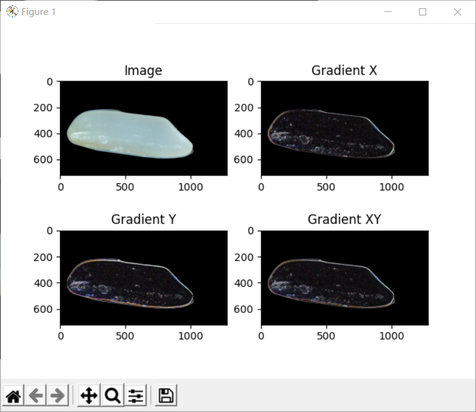

# File Description
| File Name             | Function Description                                                                                   |
|-----------------------|--------------------------------------------------------------------------------------------------------|
| fenzhi.py             | Implements functions for calculating the convex hull length and analyzing the largest/second-largest contours. |
| get_xy.py             | Displays the mouse-clicked coordinates on an image.                                               |
| grayscale.py          | Provides different methods for converting RGB images to grayscale images.                        |
| main.py               | Performs various image processing operations, including rice target region extraction, contour drawing, white spot detection, yellow rice detection, cross-section detection, etc. |
| may.py                | Implements functions for calculating the convex hull length and analyzing the largest/second-largest contours. |
| rice_detect.py        | Detects target regions in rice images, draws bounding boxes, and labels, etc.                       |
| test_canny.py         | Uses the Canny algorithm for image edge detection and dynamically adjusts parameters to display results. |
| test_contrast_stretching.py | Performs contrast stretching on images to enhance their contrast.                           |
| test_findContours.py  | Detects contours in images and draws the contours and their bounding rectangles.                   |
| test_gray.py          | Implements grayscale processing for images, including various methods and channel-based grayscale conversion. |
| test_open.py          | Uses the opening operation for background extraction and displays the foreground image.           |
| test_subtract.py      | Obtains the image foreground by subtracting the image after the opening operation.                     |

<!-- Add code execution result images below: -->

# Code Execution Results

## 1. main.py
### Rice target detection

### White Spot Detection

### Yellow Rice Detector

### Fracture Detection

